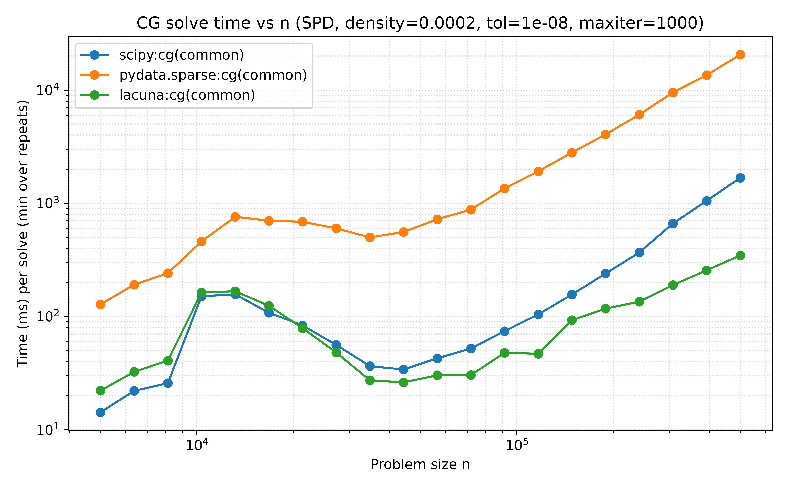
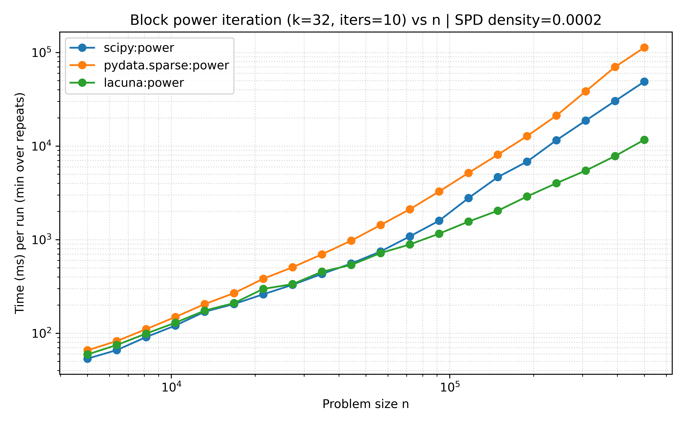
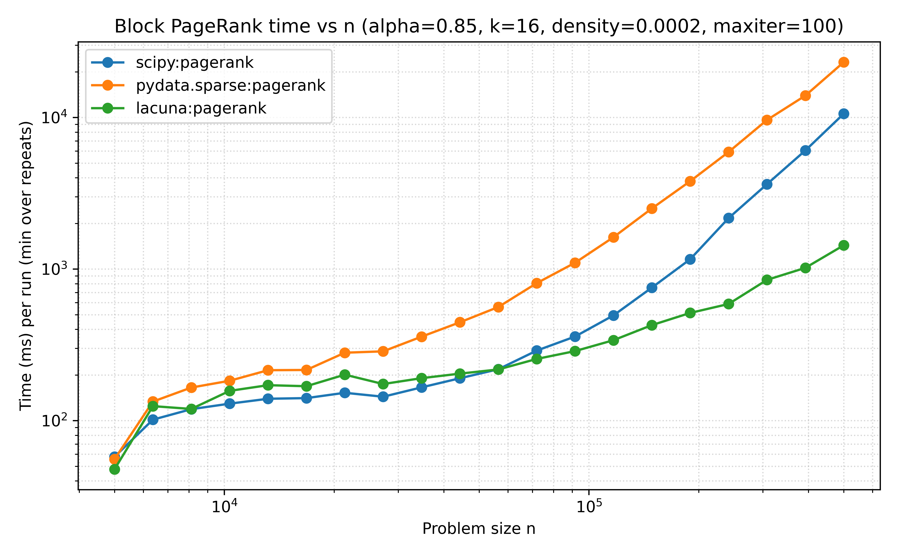

<p align="center">
  

</p>
<p align="center">High-performance Sparse Matrices for Python.</p>

<p align="center">
  <a href="https://www.rust-lang.org/"></a>
  <a href="https://pyo3.rs/"></a>
  <a href="https://www.python.org/"></a>
  
  
  <br/>
  <a href="https://crates.io/crates/wide"></a>
  <a href="https://crates.io/crates/rayon"></a>
  <a href="https://numpy.org/"></a>
  <a href="https://data-apis.org/array-api/latest/"></a>
</p>

> ⚠ Status: Work in progress. APIs and performance characteristics may change without notice. Contact us if you'd like to join the development.

## Table of Contents

- [Features](#features)
- [Quick start (development install)](#quick-start-development-install)
- [Basic usage](#basic-usage)
  - [CSC and COO quick examples](#csc-and-coo-quick-examples)
  - [ND COO (COOND) examples](#nd-coo-coond-examples)
- [Why Lacuna](#why-lacuna)
- [Benchmarks](#benchmarks)
- [Contributing](#contributing)

## Features

* Supports CSR, CSC, COO and N-D COO sparse tensors
* Provides high-performance kernels by Rust
* Compatible with NumPy array format
* Compatible with [Python array API standard](https://data-apis.org/array-api/latest/index.html)



## Quick start (development install)

Requirements:

- Python 3.10–3.13
- Rust toolchain (stable)
- pip

Install with maturin:

```powershell
python -m venv .venv
# then activate venv

python -m pip install -U maturin
maturin develop -m crates/lacuna-py/Cargo.toml --release
```

## Basic usage

```python
import numpy as np
from lacuna.sparse.csr import CSR

# A = [[1, 0, 2],
#      [0, 3, 0]]
indptr = np.array([0, 2, 3], dtype=np.int64)
indices = np.array([0, 2, 1], dtype=np.int64)
data = np.array([1.0, 2.0, 3.0], dtype=np.float64)
A = CSR(indptr, indices, data, (2, 3), check=False)

# SpMV
x = np.array([10.0, 20.0, 30.0], dtype=np.float64)
y = A @ x  # -> array([1*10 + 2*30, 3*20])

# SpMM
B = np.array([[1.0, 2.0], [3.0, 4.0], [5.0, 6.0]], dtype=np.float64)
Y = A @ B  # shape (2, 2)

# Reductions
total = A.sum()            # 6.0
row_sums = A.sum(axis=1)   # [3.0, 3.0]
col_sums = A.sum(axis=0)   # [1.0, 3.0, 2.0]

# Transpose
AT = A.T  # (3, 2)

# Arithmetic
C = A + A
Z = A - A
H = A.multiply(A)  # Hadamard (elementwise)

# Cleanup
Az = A.eliminate_zeros()
Ap = A.prune(1e-6)

# Indexing
a00 = A[0, 0]      # 1.0
row0 = A[0, :]     # dense row (numpy)
col1 = A[:, 1]     # dense col (numpy)
```

### CSC and COO quick examples

```python
import numpy as np
from lacuna.sparse import CSC, COO

# CSC
indptr = np.array([0, 1, 2, 3], dtype=np.int64)
indices = np.array([0, 1, 1], dtype=np.int64)
data = np.array([1.0, 2.0, 3.0], dtype=np.float64)
C = CSC(indptr, indices, data, (2, 3), check=False)
_ = C.sum()            # total sum
_ = C.sum(axis=0)      # column sums
_ = C.sum(axis=1)      # row sums
CT = C.T               # transpose (still CSC)

# COO
row = np.array([0, 1, 1], dtype=np.int64)
col = np.array([0, 0, 2], dtype=np.int64)
val = np.array([1.0, 2.0, 3.0], dtype=np.float64)
O = COO(row, col, val, (2, 3), check=False)
_ = O.sum()            # total sum
OT = O.T               # transpose (COO)
```

### ND COO (COOND) examples

```python
import numpy as np
from lacuna.sparse import COOND

shape = (2, 3, 4)
# indices can be flattened (nnz * ndim)
indices = np.array([
    0, 1, 2,
    1, 2, 3,
], dtype=np.int64)
data = np.array([1.0, 3.0], dtype=np.float64)
A = COOND(shape, indices, data, check=False)

total = A.sum()                # 4.0
avg = A.mean()                 # mean over full dense shape
B = A.permute_axes([2, 1, 0])  # shape -> (4, 3, 2)
R = A.reduce_sum_axes([2])     # sum over last axis -> shape (2, 3)
M = A.reduce_mean_axes([0, 2]) # mean over axes 0 and 2 -> shape (3,)
S = A.reshape((3, 2, 4))
H = A.hadamard_broadcast(S)    # broadcasting elementwise product

# Unfold to 2D sparse matrices
CSR0 = A.mode_unfold_to_csr(axis=0)  # rows = shape[0], cols = prod(shape[1:])
CSC1 = A.mode_unfold_to_csc(axis=1)
CSRrg = A.axes_unfold_to_csr([0, 2]) # group axes as rows
CSCrg = A.axes_unfold_to_csc([1])    # group axes as rows (CSC)
```

## Why Lacuna

Lacuna connects matrix-first sparse libraries with modern N-D sparse arrays: high-performance Rust kernels behind a simple, NumPy-friendly Python API and first-class N-D COO tensors.

Compared to existing options:

* **SciPy.sparse**

  * 2D, linear-algebra–first, mature and battle-tested.
  * Not natively N-D; tensor/array semantics (broadcasting, axis ops) often need reshaping or densifying.
  * No Python Array API Standard compliance
* **PyData/Sparse (`sparse`)**

  * N-D `COO` with NumPy-like semantics and broadcasting.
  * Often slower than SciPy on core kernels; smaller API surface and ecosystem.
  * No Python Array API Standard compliance

**Lacuna offers:**

* Unified N-D and 2D
* High-performance Rust native kernels
* Practical 2D ops
* NumPy compliance
* Python Array API Standard compliance

## Benchmarks

- Linear solve (CG)

  
- Block power iteration

  
- Block PageRank

  

## Contributing

We welcome contributors! If you're interested in sparse matrix, feel free to open an issue or pull request. The project is under active development, so expect rapid iteration and occasional breaking changes.
